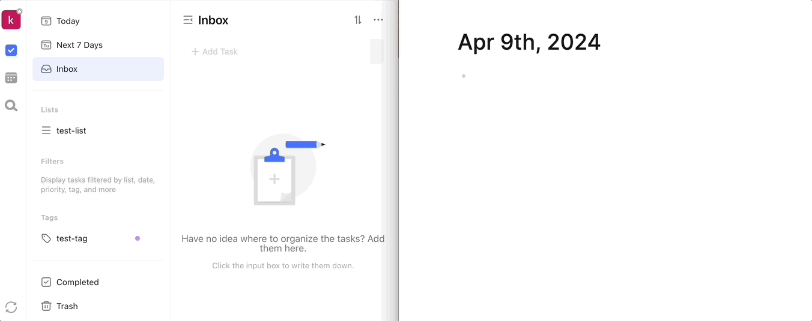

# logseq-plugin-ticktick

> 中文版 | [English Version](readme_en.md)

`logseq-plugin-ticktick` 是一款无侵入性的 TickTick / 嘀嗒清单双向同步插件，旨在无缝集成 TickTick 与 Logseq 的 TODO 体系，让用户能够在两个平台之间同步任务而无需执行任何额外命令。

## 主要功能

- **任务和子任务的双向同步**：Logseq 的 TODO 块将同步到 TickTick 作为任务，其中 TODO 块的内容成为 TickTick 任务的标题，子块作为任务的描述。如果子块被标记为 TODO，它会作为子任务同步，反之亦然，确保两个平台间任务结构的一致性。
- **自定义的优先级映射**：插件允许用户在设置中自定义 Logseq 与 TickTick 间优先级的映射关系。默认映射为 Logseq 的 #A 对应 TickTick 的高优先级，#B 对应中优先级，#C 对应低优先级。
- **计划和截至时间的双向同步**：支持计划时间和截至时间在两个平台间的同步,且当Logseq设置的计划时间带有明确时间时（而不是只设置开始日期），同步到TickTick后会带有提醒功能。
- **重复任务的双向同步**：使得重复任务在两个系统间保持一致。
- **标签和列表的同步**：TickTick 中的标签和清单将作为 Logseq 的标签（以 # 开头）添加到 TODO 块的末尾。反之，Logseq 中的标签如果和 TickTick 中的标签或清单匹配，也会同步到 TickTick 中。不匹配的标签将保留在 Logseq。

## 局限性

- Logseq到TickTick方向的同步，需要用户在编写完TODO块后**回车**才可以触发；
- 删除的同步需要用户在 Logseq TODO 块开头的点右键选择 Delete 才能触发;
- 仅支持 Logseq 中格式的重复任务同步。使用 TickTick 特殊格式的重复任务，重复规则不会同步到 Logseq，但仍会保留在 TickTick 中;
- 插件运行需要 TickTick 中至少有一个清单。

## 副作用

- 设置计划时间后，Logseq 的 TODO 块下方会生成一个空白的 LogBook。

## 安装和使用

请遵循以下步骤来安装和配置 `logseq-plugin-ticktick`：

1. 从 Logseq 插件市场安装插件。
2. 在 Logseq 中启用 `logseq-plugin-ticktick`。
3. 在插件设置中配置TickTick / 嘀嗒清单的登录Token，并根据需要配置优先级映射和其他同步选项。  
   3.1 Token需要登录TickTick/滴答清单网页版，打开开发者工具并选择网络标签(Network)，刷新页面后随机选一个请求，复制请求头中Cookie的t字段值，直至分号。
   
4. 开始在 Logseq 中创建和管理 TODO 任务，并看它们自动同步到 TickTick / 嘀嗒清单中。

## 注意事项

- 同步的时机有两处，一是当用户在Logseq编写完TODO并按回车后，该任务会同步到TickTick；二是Logseq重启时，所有未同步的任务会被同步到TickTick，并且TickTick中的任务也会同步到Logseq，该时机可在插件设置中配置快捷键手动触发。
- 初次使用时，配置完Token后，TickTick 和 Logseq 中的任务将进行一次全面互相同步。

## 许可证

`logseq-plugin-ticktick` 根据 MIT 许可证发布。详情请见 [LICENSE](LICENSE) 文件。

---

