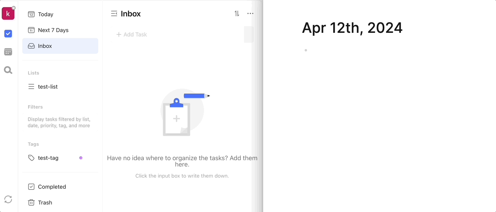

# logseq-plugin-ticktick

> [中文版](readme.md) | English Version

`logseq-plugin-ticktick` is an non-intrusive, bidirectional synchronization plugin for TickTick / Dida Task Manager, designed to seamlessly integrate the TODO systems of TickTick and Logseq, allowing users to synchronize tasks between the two platforms without any additional commands.

## Main Features

- **Bidirectional synchronization of tasks and subtasks**: TODO blocks in Logseq are synchronized to TickTick as tasks, where the content of the TODO block becomes the title of the TickTick task, and sub-blocks become the task's description. If a sub-block is marked as TODO, it will sync as a subtask, and vice versa, ensuring consistency in task structure between the two platforms.
- **Custom priority mapping**: The plugin allows users to customize the mapping of priorities between Logseq and TickTick in the settings. The default mapping is Logseq's #A corresponds to high priority in TickTick, #B to medium priority, and #C to low priority.
- **Bidirectional synchronization of scheduling and deadlines**: Supports the synchronization of planned times and due dates between the two platforms, with reminders in TickTick for Logseq tasks set with a specific time (not just a start date).
- **Bidirectional synchronization of repeating tasks**: Ensures that recurring tasks remain consistent across both systems.
- **Synchronization of tags and lists**: Tags and lists in TickTick are added as tags (starting with #) to the end of Logseq's TODO block. Conversely, tags in Logseq that match TickTick's tags or lists will also be synchronized to TickTick. Tags that do not match remain in Logseq.

## Limitations

- Synchronization from Logseq to TickTick is triggered by pressing **Enter** after completing a TODO block.
- Synchronization of deletions requires the user to right-click the dot at the beginning of the Logseq TODO block and select Delete.
- Only the format of repeating tasks in Logseq is supported for synchronization. Repeating tasks in TickTick with special formats will not sync their repeating rules to Logseq but will remain in TickTick.
- The plugin requires at least one list in TickTick to operate.
- Tags and list names in TickTick cannot contain spaces, as this will cause loss of tags or lists during synchronization.
- When there are tags and lists with the same name in TickTick, the synchronization of tasks from Logseq to TickTick will prioritize lists.

## Side Effects

- Setting a scheduling in Logseq generates a blank LogBook under the TODO block.

## Installation and Usage

Please follow these steps to install and configure `logseq-plugin-ticktick`:

1. Install the plugin from the Logseq plugin marketplace.
2. Enable `logseq-plugin-ticktick` within Logseq.
3. Configure the login Token for TickTick / Dida in the plugin settings, along with any necessary priority mapping and other sync options.
    - To obtain the Token, log in to the TickTick/Dida web version, open the developer tools, select the Network tab, refresh the page, randomly select a request, and copy the value of the `t` field in the Cookie from the request header, up to the semicolon.
      
4. Start creating and managing TODO tasks in Logseq, and watch them automatically sync to TickTick / Dida.

## Notes

- Synchronization occurs in two scenarios: when a user completes a TODO in Logseq and presses enter, and when Logseq restarts, at which point all unsynced tasks are synchronized to TickTick, and tasks from TickTick are also synced to Logseq. This can be manually triggered in the plugin settings through a configured shortcut.
- Upon first use after configuring the Token, all tasks in TickTick and Logseq will undergo a comprehensive mutual synchronization.

## License

`logseq-plugin-ticktick` is released under the MIT license. See [LICENSE](LICENSE) file for details.

---

Happy task managing across Logseq and TickTick!
